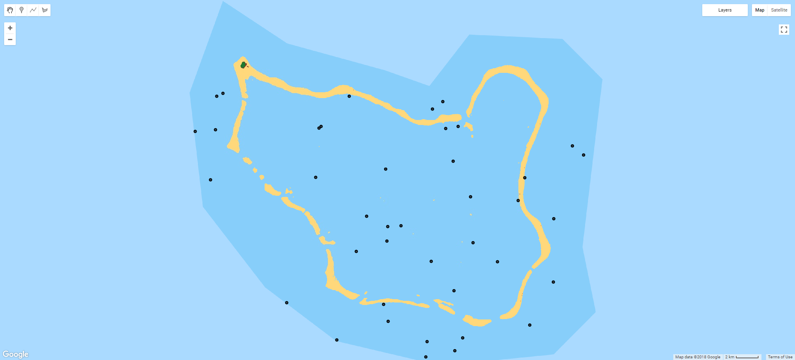

# Measuring atoll island land area in Google Earth Engine

The scripts in this repo show how I used Google Earth Engine to measure atoll island land area change at a global scale.

## Table of Contents

- [Introduction](#intro)
- [Creating composite images](#data)
- [Composite classification](#class)
- [Accuracy assessment](#aa)
- [Post classification filtering](#filt)


<a name="intro"></a>
## Introduction

The rationale behind this research was very simple.

- Due to effects of climate change (sea level rise, increase in storminess etc.) there is global concern surrounding the future persistence of atoll islands, which represent the only habitable land for nations such as Tokelau, Kiribati and the Marshall Islands.

- Despite this concern, there have been relatively few studies which have quantitatively assessed atoll island change to date, resulting in limited and fragmentary monitoring of island land area.

- To date, research has occurred at the scale of individual atolls or small numbers of proximate islands while generally utilizing only two or three observations. This limited scale is the result of the availability and cost of high resolution satellite and historic aerial imagery.

- The number of islands that may reasonably be covered is also limited by the time-consuming nature of the existing approach: the shoreline or accepted shoreline proxy of the island(s) in question is digitized from the high resolution imagery by hand using ArcMap, a tricky process that requires careful attention.

Accordingly, I set out to develop an approach to monitoring atoll island land area which operated at the global scale. Key to this was using the freely available Google Earth Engine (GEE) [(sign up here)](https://earthengine.google.com/signup/). GEE is a platform for geospatial analysis that allows users to harness cloud-based super-computing to dramatically increase the scale at which research may be undertaken. The GEE catalog contains a vast amount of data which constantly being expanded and refined. Critically, the majority of the current Landsat archive is available for use within GEE.

<a name="data"></a>
## Creating composite images
The included atolls were separated into 278 separate units via polygons produced in QGIS 3.0. The reasons for this were threefold: such geometries were required to spatially filter the available imagery to retrieve scenes which covered targeted areas; it allowed the composite images to be clipped, saving storage space and reducing the processing load by excluding unrequired pixels; finally, it permitted classified results to be separated as meaningful units. Each ROI was given an individual numerical ID, allowing specific features, or groups of features, to be included or excluded from the analysis. The ROI polygon can be uploaded as a GEE asset [(learn about that here)](https://developers.google.com/earth-engine/importing). The following code creates an ROI variable, adds to it the map view and centres the map screen on it. 

```javascript
//Select roi
var roi = fsm_roi_limit

//Add roi to the map. Using the inspector tab allows name and id to be verified by clicking.
Map.addLayer(roi,{},'ROI');

//Centre the map view on the ROI
Map.centerObject(roi)
```

Now that the ROI has been added, we can create an [image collection](https://developers.google.com/earth-engine/ic_creating) from which a composite image will be produced. Adding Landsat data (or any other sources within the EE catalog) is as simple as selecting it from the list add clicking import, or calling it directly in code, as I have done below for the T2 Landsat 8 TOA collection (this process is exactly the same for any other image collections, e.g. T1 TOA, T1 SR). 


### Spatial and temporal filtering
Obviously, we only want to create a composite of certain areas and within a certain date range - so the initial image collection, which contains every scene in that collection, will need to be filtered. Filtering an image collection by date is achieved by calling the filterDate method on your image collection. The method takes a start date and an end date. I was attempting to produce annual composites, so the code reads from a list of years, but you can just as easily manually write in dates in the 'YYYY-MM-DD' format instead.

Filtering spatially is simple as we have an ROI object already, but you may also do this manually by using a geometry drawn within GEE instead. Simply call the .filterBounds method on your image collection with the geometry or feature you want to use in brackets.

Once the image collection has been filtered, the collection is printed to the console, which allows it to easily be reviewed, with the metadata of the collection and each scene available. The size (number of scenes) of the collection post filtering is also printed for reference.

```javascript
//Select date 
var year = ['2014','2014']
print('Year: ',year[0])
var start = ee.Date(year[0]+'-01-01');
var end = ee.Date(year[1]+'-12-31');

var ls8t2col = ee.ImageCollection('LANDSAT/LC08/C01/T2_TOA')
  .filterDate(start,end)
  .filterBounds(roi)
print(ls8t2col)
print('C1 T2 size: ',ls8t2col.size());
```


### Cloud masking
So now the ls8t2col variable contains all available scenes which were within the space and date range we specified. However, if we were to preform a reduction (combine all the scenes within the collection into one composite) the results would be very poor, like in the example below. 


Anyone who has attempted passive satellite-based remote sensing in the tropics will have struck the same issue: clouds. Given the footprint of a single Landsat scene is some 185 by 180 km, at the latitudes in which coral reefs occur having a cloud free image is definitely the exception rather than the rule. Clouds are the enemy and would need to be removed before any approach to automate island detection could be successfully implemented within GEE.

To solve this issue, the cloudy pixels of every scene in the filtered collection were eliminated. This process, called cloud-masking, was achieved in GEE using the BQA band and Fmask appended to the Landsat scenes. Note that Fmask is only available in specific collections in the GEE catalog, and they are labelled as such, e.g. LANDSAT/LC8_L1T_TOA_FMASK.

BQA uses a bitwise system to flag pixels likely to have a range of issues such as cloud contamination. More information on this can be found [here](https://landsat.usgs.gov/qualityband). However, I found that only using pixels labelled as 'clear' worked well (I’m sure with more work this approach could be improved). 

```javascript
/*Eliminate pixels tagged as cloud by BQA - useful when less imagery is available, but does give worse results
compared to only selecting clear pixels (as below)*/
var bqa = function(image) {
  var qa = image.select('BQA');
  var mask = qa.bitwiseAnd(Math.pow(2, 12)).neq(1).and(qa.bitwiseAnd(Math.pow(2, 14)).neq(1)); 
  return image.updateMask(mask.not())
};

// Only select the pixels labeled 'clear' in the quality band
var bqa = function(image) {
  return image.mask(image.select('BQA').eq(2720));
};
```
Note that for landsat 7, the 'clear' value is different:

```javascript
var bqa = function(image) {
  return image.updateMask(image.select('BQA').eq(672));
};
```

Using Fmask is very simple, but the Fmask collections are being deprecated, so using BQA is the better long term approach. 

```javascript
// Apply Fmask
function fmask(image) {
  return image.updateMask(image.select('fmask').lte(1));
}
```
Here cloud-masking is implemented as a function, and needs to be called on the image collection in order to work. To do this for every single scene in the image collection, it needs to be [mapped](https://developers.google.com/earth-engine/ic_mapping) using the *map()* function. The code below applies the BQA function to the ls8t2col collection. As we will no longer need the BQA band after the cloud filtering has been completed, this is a good time to eliminate bands you will not use. This can be done using the *select()* function with a list of bands you want to keep, e.g. 'B1','B2','B3','B8'. Since the bands I wanted to keep are contiguous, I used the shorthand 'B[2-8]'.

```javascript
var t2Filt = ls8t2col
  .map(bqa)
  .select('B[2-8]');
```

Now that we have removed the cloudy pixels from each image in the collection, we can produce a composite image. To do this, the image collection needs to be converted into a single image. In GEE, going from multiple (an image collection) to single (a single composite) is achieved using a [reducer](https://developers.google.com/earth-engine/reducers_intro). There are reducers available for most aggregating statistics, such as mean, median, mode, min, max, standard deviation etc. I found median to provide the best results, with mean being more influenced by the extremes in pixel values contributed by cloud and cloud shadow that persisted through the masking process. Note that the composite is also clipped by the calling the *clip()* method with the roi object used as the input geometry. This makes the output much easier to analyse, but does not speed up reduction process. Again, you can also clip images using a geometry drawn within GEE.

```javascript
var t2median = t2Filt
  .median()
  .clip(roi)
```


### Visualising results
To visualise the result, we need to add the composite to the map as a layer. This is done using the *Map.addLayer()* function. This function takes an image, an object containing visualization parameters (such as which bands to use, gamma and stretch etc.) and optionally a label and a flag to automatically turn the layer on or off (this can be useful if you have many layers, but only want GEE to process the one you are interested in at the time). 

```javascript
Map.addLayer(t2median, ls8viz, '{bands: 'B4,B3,B2', gamma: 2}', true);
```

If you are visualising a number of similar images, it can be cleaner to create a visualization parameter object and calling it for all instances, rather than repeating it for each *Map.addLayer()* call, as below.

```javascript
var ls8viz = {bands: 'B4,B3,B2', gamma: 2};

Map.addLayer(t2median, ls8viz, 'ls8 t2 bqa median',false);
Map.addLayer(t2Unfilt, ls8viz, 'ls8 t2 unfiltered median',false);
```

With cloud-masking and a median reduction, this T2 Landsat composite is looking far better.


### Combining multiple image collections
Now it starts getting a bit more technical. While you may wish to use only one image collection in your workflow for the sake of simplicity, better results may be possible by combining multiple collections (i.e. T1, T2, masked and unmasked) to achieve maximum coverage and image quality. In the first code snippet the gaps in the filtered T2 collection (where there have been clouds detected for a pixel representing the same geographic location in every image in the collection) are filled by using an unfiltered median or min composite. This ensures no gaps persist, but the trade-off is that cloud artefacts may persist in the final composite.


```javascript
//This code fills in gaps of the filtered t2 median with unfiltered T2 median pixels 
var fillerMask = t2median.unmask().not();
var filler = t2Unfilt.updateMask(fillerMask);
var t2median = (t2median.unmask().add(filler.unmask()))
```

In the following snippet, individual atolls with poor T1 coverage can be excluded and replaced with the respective T2 version. 

```javascript
// Here is where the T1 results can be cut out and replaced with T2. Can give better results. 
ls8t1col = ls8t1col.clip(roi
.filter(ee.Filter.neq('Id',9))
.filter(ee.Filter.neq('Id',10))
)

// This code fills in gaps in the T1 composite with the T2 median pixels 
var fillerMask = medT1.unmask().not();
var filler = t2median.updateMask(fillerMask);
var final = (medT1.unmask().add(filler.unmask())).clip(roi)
```

### A quick note on built-in GEE Landsat algorithims
GEE has a number of built-in algorithms specific to particular sensors, including Landsat. These include simpleCloudScore (*ee.Algorithms.Landsat.simpleCloudScore()*), simpleComposite (*ee.Algorithms.Landsat.simpleComposite()*) and methods for TOA or SR conversion. These require raw Landsat data, rather than the TOA used here. The simpleCompostie algorithm works very well, and can be used to quickly produce composites of large areas. However, the cloud-masking approach it employs struggles with the bright coral sands found within atoll environments and as such can produce notably inferior results to the (much more involved) workflow outlined above. Outside of these locations it works very well. [This script](https://code.earthengine.google.com/6cec9db5f8b866afb64cdc7e3f752c76) shows how simpleComposite works and gives and example generated from six months of Landsat 8 T1 scenes. 

### Pan-sharpening
Now that a final composite has been produced, any additional transformations can be undertaken such as pan-sharpening and band ratioing. [Pan-sharpening](https://developers.google.com/earth-engine/image_transforms) is easy to achieve, but make sure that the resulting sharpened image is exported at the resolution of the pan rather than multispectral bands. 

```javascript
// Convert the RGB bands to the HSV colour space.
var hsv = image.select(['B3', 'B2', 'B1']).rgbToHsv();

// Sharpen the HSV values with the 15 m pan band (B8) to create a pan-sharpened image
var sharpened = ee.Image.cat([hsv.select('hue'), hsv.select('saturation'), 
image.select('B8')])
  .hsvToRgb()
  .multiply(255)
  .uint8()
  .clip(roi);
```

This could also easily be rewritten as a function (here for Landsat 8):

```javascript
// Sharpen the HSV values with the 15 m pan band (B8) to create a pan-sharpened image
var toPS = function(image){
  // Convert the RGB bands to the HSV color space.
  var hsv = image.select(['B3', 'B2', 'B1']).rgbToHsv();
  var pan = image.select('B8')
  // Sharpen the HSV values with the B8 15m band to create a pan-sharpened image
  return ee.Image.cat([hsv.select('hue'), hsv.select('saturation'), pan])
    .hsvToRgb()
    .multiply(255)
    .uint8()
};

// Call the toPS function on an image
var sharpened = toPS(image)
```


### NDSV
Using the [normalised difference spectral vector (NDSV) approach](https://ieeexplore.ieee.org/document/6587128/) improved classification performance in this study. This involves producing a pseudo multispectral image from all possible unique band ratios. Here this includes all the 30 m resolution B, G, R, NIR, SWIR1 and SWIR2 bands, resulting in 15 band ratios. Band ratioing is a common practice within remote sensing, used to remove the radiometric influence of topography, or to provide a single value for quantitative analysis (e.g. NDVI). Below is a 1 band image of the 10th ratio, between B3 (red) and B4 (NIR).


Note the implementation below renames the Landsat 8 bands to make blue B1, rather than coastal-aerosol. The Landsat 7 implementation also renames the bands, allowing the NDSV images produced using both sensors to be directly compared. Bands may be renamed using the *select()* function: two lists of the same length are required as an argument, the first containing the bands you wish to select and the second the new band labels (in order). 

```javascript
var toNDSVLS8 = function(image){
image = image.select(
  ['B2', 'B3', 'B4', 'B5', 'B6', 'B7'],
  ['B1','B2', 'B3', 'B4', 'B5', 'B6']
  );
var ndsv = image.normalizedDifference(['B1','B2']).rename('R1');
ndsv = ndsv.addBands(image.normalizedDifference(['B1','B3']).rename('R2'));
ndsv = ndsv.addBands(image.normalizedDifference(['B1','B4']).rename('R3'));
ndsv = ndsv.addBands(image.normalizedDifference(['B1','B5']).rename('R4'));
ndsv = ndsv.addBands(image.normalizedDifference(['B1','B6']).rename('R5'));
ndsv = ndsv.addBands(image.normalizedDifference(['B2','B3']).rename('R6'));
ndsv = ndsv.addBands(image.normalizedDifference(['B2','B4']).rename('R7'));
ndsv = ndsv.addBands(image.normalizedDifference(['B2','B5']).rename('R8'));
ndsv = ndsv.addBands(image.normalizedDifference(['B2','B6']).rename('R9'));
ndsv = ndsv.addBands(image.normalizedDifference(['B3','B4']).rename('R10'));
ndsv = ndsv.addBands(image.normalizedDifference(['B3','B5']).rename('R11'));
ndsv = ndsv.addBands(image.normalizedDifference(['B3','B6']).rename('R12'));
ndsv = ndsv.addBands(image.normalizedDifference(['B4','B5']).rename('R13'));
ndsv = ndsv.addBands(image.normalizedDifference(['B4','B6']).rename('R14'));
ndsv = ndsv.addBands(image.normalizedDifference(['B5','B6']).rename('R15'));
return ndsv.clip(roi)
};
```

Landsat 7 implementation:

```javascript
var toNDSVLS7 = function(image){
image = image.select(
  ['B1','B2', 'B3', 'B4', 'B5', 'B7'],
  ['B1','B2', 'B3', 'B4', 'B5', 'B6']
  );
var ndsv = image.normalizedDifference(['B1','B2']).rename('R1');
ndsv = ndsv.addBands(image.normalizedDifference(['B1','B3']).rename('R2'));
ndsv = ndsv.addBands(image.normalizedDifference(['B1','B4']).rename('R3'));
ndsv = ndsv.addBands(image.normalizedDifference(['B1','B5']).rename('R4'));
ndsv = ndsv.addBands(image.normalizedDifference(['B1','B6']).rename('R5'));
ndsv = ndsv.addBands(image.normalizedDifference(['B2','B3']).rename('R6'));
ndsv = ndsv.addBands(image.normalizedDifference(['B2','B4']).rename('R7'));
ndsv = ndsv.addBands(image.normalizedDifference(['B2','B5']).rename('R8'));
ndsv = ndsv.addBands(image.normalizedDifference(['B2','B6']).rename('R9'));
ndsv = ndsv.addBands(image.normalizedDifference(['B3','B4']).rename('R10'));
ndsv = ndsv.addBands(image.normalizedDifference(['B3','B5']).rename('R11'));
ndsv = ndsv.addBands(image.normalizedDifference(['B3','B6']).rename('R12'));
ndsv = ndsv.addBands(image.normalizedDifference(['B4','B5']).rename('R13'));
ndsv = ndsv.addBands(image.normalizedDifference(['B4','B6']).rename('R14'));
ndsv = ndsv.addBands(image.normalizedDifference(['B5','B6']).rename('R15'));
return ndsv.clip(roi)
};
```

Also note that both the Landsat 8 and Landsat 7 NDSV code snippets are functions, and thus must be called on the image object (which contains the required bands) to produce an NDSV image. As this is generally done after your image collection has been reduced to a single image (i.e. your final composite) you do not need to use *map()* (though you could if you wanted to apply NDSV to every image in a collection). Instead, it is simply called like so:

```javascript
var nd = toNDSVLS7(image)
```

### Image Export

Depending on the size of your study area and the number of scenes being reduced, it make take some considerable time for GEE to process the final composite. You may also notice that the composite takes a while to reload when the zoom level is changed - this is because GEE processes at the scale set by the zoom level - esentially a level in the [pyramid](https://developers.google.com/earth-engine/scale) approach common to many GIS platforms.

Any subsequent calculations that rely on the final composite will also be slow, since it will need to be computed beforehand. Some more complex calculations, such as classification, may not work at all, timing out or running over the GEE user memory limit. This issue becomes magnified when trying to deal with multiple composites covering different date ranges - clearly processing multiple composites within the same script would be difficult and highly inefficient. To address this issue, images and features that are created within GEE scripts may be exported as a GEE [asset](https://developers.google.com/earth-engine/exporting). After export, assets may be imported into a script from the assets tab (on the left of the window by default). Imported assets perform much better in complex calculations, as less processing needs to be done 'on the fly'. Both images and features may also be exported to the drive of the google account associated with GEE, allowing data produced in GEE to be used outside of it in the traditional matter. The following code snippet shows how the final composite (finalComp) is exported as a GEE asset. There are a few things to note here: the *Export.image.toAsset()* function takes a number of arguments, but not all are required, and some (such as scale) make others redundant. In cases like these, it can be easier to use curly brackets { } within the function brackets ( ). This allows the arguments to be specifically called by name and followed by : before answering the argument as normal. This can also make it clearer what each argument in a complex function is doing, improving readability.

```javascript
Export.image.toAsset({
  image: finalComp.select('B[2-7]'),
  description: year[0]+'_LS8_Full_median_'+place+'_clipped',
  assetId: place+'/full_composite/LS8_'+year[0]+'_new_median_full_composite_'+place+'_clipped', 
  region: roi.geometry().bounds(), 
  scale: 30, 
  maxPixels: 1e13});
```

A couple of these arguments warrant further discussion. The description and assetId arguments are strings (i.e. text), but you can concatenate variable values onto text using +. In this example the variables **place** and **year** are concatenated to save having to rewrite each when the area or timespan of the composite being generated is changed (these variables are defined at the top of the code, and the year variable was also used to define the time range during the temporal filtering of the image collection). 

The region is the geometry of the area you wish to export. Note that this needs to be a single polygon. If you use a multipolygon, the export will fail. An easy way to get around this issue is to either draw a polygon within GEE, or (as above) call the *geometry()* and *bounds()* methods (in that order) on an existing feature such as an roi polygon. The *geometry()* function creates a geometry object from the feature coordinates, and *bounds()* creates a single bounding box that contains all of the polygons that the feature may be comprised of. Note that if you do not specify this, it will default to the area of your map view at the time when the function is called (this can be useful when making figures).

The scale argument controls the resolution at which your asset will be exported at. This is important to specify, as by default it is set to 1000 m. In most cases this will be the native resolution of your imagery (in this case the multispectral bands of Landsat 8, which are 30 m. If pan-sharpened imagery was being exported instead, this should be set to 15 m). Note that higher resolutions will take up more of your 250 GB asset allowance for the same geographic area. Also note that going beyond the native resolution of your imagery is pointless (i.e. exporting Landsat 8 data at 1 m resolution).

Finally, the maxPixels argument does exactly what it says on the tin. You will get an error if you go above 1e8, in which case you will 
need to specify a higher limit using maxPixels. The current upper limit is 1e13. If this is still too low, consider using a coarser resolution, a more constrained region, or if using an existing region geometry, splitting it into smaller chunks.

<a name="class"></a>
## Composite classification

Now that the composite imagery has been generated and saved as assets, they can be classified. Classification involves using a special algorithm (a classifier) to determine which of a user defined group of classes each pixel is most likely to represent. In this case, decisions are based upon the spectral values of each pixel (per band) after the classifier has been trained using a labelled dataset of representative pixels. For more information on classification within GEE, see this [GEE Classification video tutorial](https://developers.google.com/earth-engine/tutorials#classification). For the purposes of this tutorial, a single date classification (training data sampled from one image) will be prepared initially, then multi-date classification will be discussed.  

For ease of use, I created a new script for classification, keeping it seperate from the code which produces the composites detailed above. To begin, in a new script the previously generated composite NDSV image was defined as the variable **toClassify** and clipped to the roi (the same as the previous script). Note that clipping does not carry over in exported assets: the area clipped out when generating the composite will be all black (i.e. null), but for visualistion purposes it is best to clip this off by clipping the image again. This code also adds the image to be classified to the map view (Map.addLayer(...)).

```javascript
var toClassify = n17
toClassify = toClassify.clip(roi);

var ls8viz = {gamma: 2, bands: 'B5,B4,B3'}
Map.addLayer(toClassify.clip(roi), {gamma: 2.1}, 'to classify');
```

### Creating training samples

Training samples generally take the form of polygonal geometries within which pixels are sampled. As such, they can be created within GEE using the built-in geometry tools, or imported from existing shapefiles etc. The important thing here is that the training samples have a property which describes which class they represent. When using the GEE geometry tools, this can be achieved by clicking the cog icon next to the layer in the geometry list at the top left corner of the map view and selecting to import as a feature or featureCollection (I found that featureCollection works well in this instance). This will allow you to add a property to the training sample, such as 'class' etc. Generally classes are coded by number (i.e. water = 0, vegetation = 1, urban = 2). This allows easy visualisation and later accuracy assessment. The image below shows a composite image with a number of training polygons representing different classes (e.g. black for water, green for vegetation).


### Sampling the image

Now that the training samples and the image to be sampled from are both present, a training dataset can be built. This is done using the *sampleRegions()* function, which is called on the image from which the training data is to be generated. In the code below, my NDSV composite, loaded into the variable **toClassify**, is being sampled. The *sampleRegions()* function has a number of arguments which need to be answered: the collection is the training sample polygons (with a class property) that you are using. In the example below the collection is the merged feature collections for each class (i.e Wt for water, Vg for vegetated etc.) You may also produce this collection of training samples as as a distinct variable prior to using this function instead. The properities argument defines which properties of your training feature collection to copy: in this case, the class property is required. Finally, scale, projection and tilescale are optional arguments (scale defaults to the resolution of the first band of the input image, while tileScale can be useful when undertaking very large number of samples).

```javascript
var training = toClassify.sampleRegions({
	collection: Wt.merge(Sh).merge(Vg).merge(Urb),
	properties: ['class'],
});
```

This produces a featureCollection object with each pixel sampled a feature containing the values of that pixel per band, and the class it was labelled as. 

### Choosing and training a classifier

Now that a training dataset has been prepared, it is time to choose a classifer to use and train it. GEE has a many different classifiers available, each with a range of user adjustable parameters. In the code snippet below the **classifier** variable is defined as the GEE Suport Vector Machine (SVM) classifier. The full list (as well as the adjustable parameters for each) can be viewed in the ee.Classifier section of the Docs tab to the left of the map view. 

```javascript
var classifier = ee.Classifier.svm();
```

To train the selected classifier, call the *train()* function on it. The required arguments are the input training features (the training data generated by the code snippet above), the class property (whatever property contains the class code) and the input properties (in this case the bands of the NDSV image being classified).

```javascript
// Train the chosen classifier 
var fullClassifier = classifier.train({
  features: training, 
  classProperty: 'class', 
  inputProperties: ['R1', 'R2', 'R3', 'R4', 'R5', 'R6', 'R7', 
  'R8', 'R9', 'R10', 'R11', 'R12', 'R13', 'R14', 'R15']
});
```
With the classifier trained, it is simply a case of calling the *classify()* function on the image to be classifed, using the trained classifier object as the argument.

```javascript
// Classify the images.
var classified = toClassify.classify(fullClassifier);
```

### Visualising the classification

Now the classification needs to be visualised. This is a bit different to visualising a normal image, as the pixel values now describe a class rather than the brightness (reflectance) within a given spectral window (band). Thus we need to assign a colour to each class, making it easy to understand which class pixels have been allocated to. GEE provides the palette object to achieve this. Palettes can only be used on an image with a single band, and can be used as a ramp (such as for a DEM etc.) or categorically (as here). The palette is a list of colours which is called as part of the visualiation parameters used with the *Map.addLayer()* function. These colours need to be [CSS style](https://en.wikipedia.org/wiki/X11_color_names) strings (names or hex). For more information on palettes, check the [GEE guide](https://developers.google.com/earth-engine/image_visualization).

```javascript
var palette = ['LIGHTSKYBLUE', 'DARKGREEN', 'LEMONCHIFFON','ORANGE'];

Map.addLayer(classified.clip(roi), {palette: palette, min: 0, max: 4},'classified '+year);
```


GEE expert [Gennadii Donchyts](https://twitter.com/gena_d) developed code to add support for [ColorBrewer](http://colorbrewer2.org/), a useful resource for choosing colour schemes for thematic maps with continious or categorical data. The colorbrewer function can be sourced from Gennadii like below. To choose a specific colorbrewer palette, call colorbrewer.Palettes. and then the chosen set (e.g. BuGn, Greys, Set3 etc) and the number of classes or breaks in sqaure brackets. 

```javascript
var colorbrewer = require('users/gena/packages:colorbrewer')
var palette = colorbrewer.Palettes.Set2[4]
```

<a name="aa"></a>
## Accuracy assessment

For the results of any classification to be useful, the accuracy must be quantified. No classification will ever be 100% accurate, due to noise in the image, the limitations of the classifier etc. Clearly it is not possible to check every pixel has been correctly classified, so a representative sample of reference points is required. This sample may then be ground-truthed (manually corrected) and used to compare how well the classifier preforms.

For the accuracy values to be meaningful, a number of factors must be considered: 

- how should the points be distributed (what sampling technique should be implemented)?
- how many accuracy assessment/reference points are required (what is the required sample size)?
- what reference material should be used to determine ground truth?

### Sampling technique
There are numerous stratergies for how to select reference points: purely random, systematic (i.e. regular), clustered etc. While a purely random distribution within the target area may be the most 'scientific', the nature of atoll island enviroments (large amounts of water relative to small clusters of land) means that this stratergy isn't workable. This problem is illustrated in the image below: of the 40 random points distributed within the ROI polygon, only 1 or 2 were not pixels classified as water (the island at the top left, the only land area of the atoll, had no reference points at all). Therfore, any miss-classification of non-water classes that did occur would not be reflected in the accuracy results. Given the stated aim of measuring land area change, random sampling (or using a regular grid) is clearly unworkable.



Accordingly, a thematically stratified random sampling technique is the best option, as shown in the image below. Equal numbers of reference points are randomly distributed within the area allocated to each class of a classified image. This maintains the statistical robustness of random sampling while ensuring that minority classes (i.e. land) are also properly represented.


### Sample size

Determining the number of reference points (sample size) is a balance between ensuring a representative sample with the substantial time investment that truthing points against reference data requires. Generally more than 50 points per class are recomended, increasing to 75 - 100 for larger areas (> 400 km<sup>2</sup>) or large numbers of classes (i.e. >12) ([Congalton, 1991](https://www.sciencedirect.com/science/article/pii/003442579190048B)). Much more material on this issue is available, including emperical equations for determining sample size. 

Note that while it would be possible to use the training samples that were already produced to measure accuracy, this presents a number of issues: the training samples are based on pixels for which the correct class is obvious, and as such they are more likely to be correctly classified than a randomly selected pixel outside of the training samples, resulting in an overestimation of classification accuracy. The accuracy value will also be biased by the relative number of pixels sampled through training for each class. For instance, it is simple to generate large training polygons of water in atoll environments, while urban areas tend to be relatively much smaller, resulting in far fewer urban training pixels when compared to water. Thus is water is classified accurately and urban is not, the predominance of water pixels in the training data will give an overestimation of classification accuracy that does not fairly represent all classes. 

### Generating reference points

GEE has a built in function for stratified random sampling, making it very easy to achieve. This function (*stratifiedSample()*) takes the number of points (note this is per class, not in total), the band containing the classification, the region to sample in, wether to ignore masked pixels (dropNulls) and wether to include a geometry with each sample (so each sample has a point geometry). The function is called on the classified image, as in the code snippet below.

```javascript
// Create AA points
var aaPoints = classified.stratifiedSample({
	numPoints: 50, 
  	classBand: 'classification', 
	region: roi, 
	dropNulls: true, 
	geometries: true})
```

Now that the points have been created, they need to ground-truthed against reference material (i.e. ensuring that the reference points have the correct class). This data should be of higher resolution than the imagery being classified and captured at a similar enough time for change to not have occured (which would make the comparison void). There are a number of ways to do this, both within earth engine using a different data source (e.g. Sentinel-2) or outside using other data sources. Given the relative lack of imagery coverage for atoll enivorments, I exported my points as a .shp and ground-truthed against a range of sources, including Google Earth, Planet and RapidEye data for the 2016 year (which had the most data available). The reference points may be exported for ground-truthing using google drive, as in the code snippet below. Make sure that the fileFormat argument is set to the filetype you wish to use.

```javascript
Export.table.toDrive({
	collection: aaPoints, 
	description:'aa_points', 
	folder:'seperate_outputs', 
	fileFormat :'SHP'})
```

Once the points have been ground truthed, they can be uploaded back into GEE. From the Assets tab, click New, then Table upload. Click select, then naviagate to the folder where your data is located and select it (making sure to include the required metadata files in the case of a .shp). Name the file, click ok and it will be 'ingested', becoming avaialbe within your GEE assets.

Once ingested, this data can be used to determince the accuracy of your classification. To do this, use the sampleRegions function again, this time using the reference points (here **fsm_aa**) instead of training samples. These samples are then classifed by the same classifier to produce a validation dataset, which contains two properites, one with the reference ('true') class (here **'classifica'**) and the class alaocated by the classifier (**'classification'**). The two are compared using the *errorMatrix()* function, as in the code snippet below.

```javascript
// Test the classifiers' accuracy
var testing = toClassify.sampleRegions({
	collection: fsm_aa,
	properties: ['classifica'],
	scale: 30
});

var validation = testing.classify(fullClassifier);

// Produce an error matrix 
var errorMatrix = validation.errorMatrix('classifica','classification');

```

Now that the errorMatrix object has been generated, it may be printed to the console. Other accuracy metrics may also be printed by calling additional functions such as accuracy() and producersAccuracy() on the matrix object.

```javascript
print('Confusion table:', errorMatrix);
print('Accuracy: (correct/total)', errorMatrix.accuracy());
print('Consumer\'s accuracy (comission) (across):', errorMatrix.consumersAccuracy());
print('Producer\'s accuracy (omission) (down):', errorMatrix.producersAccuracy());
```

Exporting the classified image is very similar to exporting the composite image. However, since the classification is catergorical rather than continious, future visualisation will work better if the 'mode' pyramiding policy is selected. GEE automatically makes lower resolution versions of your images to speed up visualisation when operating at large scales (zoomed out). The pyramiding policy of an image determines how these lower quality versions are generated. The default (mean) works well for normal images as it averages the pixel values when you are zoomed out, but since the average of class values is meaningless, using the most prevalent class (mode) is a better choice. 

```javascript
//Export the classified result
Export.image.toAsset({
  image: classified, 
  description: year+'_palau_split_urb_veg_SVM_class',
  assetId: 'palau/class_splitGen/'+year+'_palau_split_urb_veg_class',
  region: roi.geometry().bounds(), 
  scale: 30, 
  maxPixels: 1e13,
  pyramidingPolicy: {".default": "mode"},
});
```

<a name="filt"></a>
## Post classification filtering

A common practice within classification workflows is post-classification filtering, where the raw classifications are processed to (hopefully) remove the so called 'speckle' (aka 'salt and pepper') effect, where there are numerous single pixels classed as something different to their neighbour. Generally this issue is addressed through the use of a generalising, window based function such as majority filtering, sieving etc. GEE supports focal based [morphological operations](https://developers.google.com/earth-engine/image_morph) to achieve this. 

While the cloud-filtering prior to classification is reasonably effective, it is likely that some cloud artefacts persisted into the final composite and were classified (particularly if there was limited image availability for the given location).

