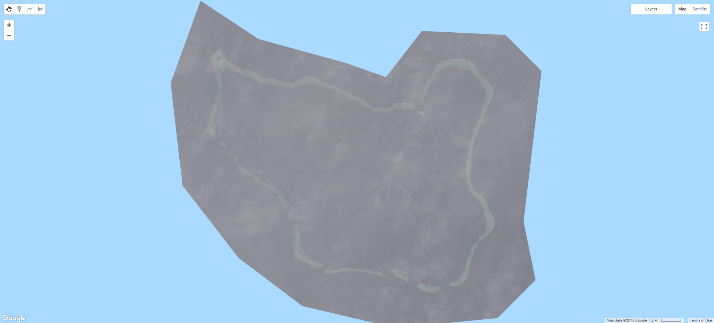
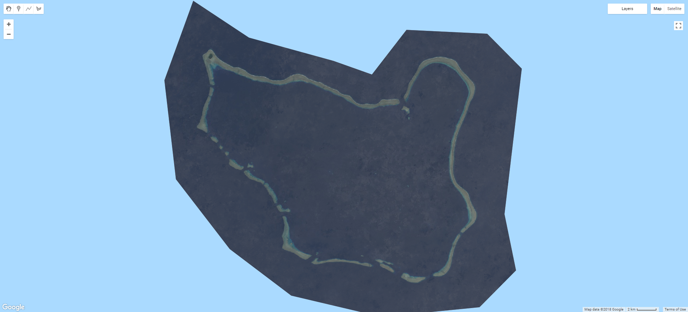

# Measuring atoll island land area in Google Earth Engine

The scripts in this repo show how I used Google Earth Engine to measure atoll island land area change at a global scale.

## Table of Contents

- [Introduction](#intro)
- [Creating composite images](#data)
- [Composite classification](#class)
- [Accuracy assessment](#aa)


<a name="intro"></a>
## Introduction

The rationale behind this research was very simple.

- Due to effects of climate change (sea level rise, increase in storminess etc.) there is global concern surrounding the future persistence of atoll islands, which represent the only habitable land for nations such as Tokelau, Kiribati and the Marshall Islands.

- Despite this concern, there have been relatively few studies which have quantitatively assessed atoll island change to date, resulting in limited and fragmentary monitoring of island land area.

- To date, research has occurred at the scale of individual atolls or small numbers of proximate islands while generally utilizing only two or three observations. This limited scale is the result of the availability and cost of high resolution satellite and historic aerial imagery.

- The number of islands that may reasonably be covered is also limited by the time-consuming nature of the existing approach: the shoreline or accepted shoreline proxy of the island(s) in question is digitized from the high resolution imagery by hand using ArcMap, a tricky process that requires careful attention.

Accordingly, I set out to develop an approach to monitoring atoll island land area which operated at the global scale. Key to this was using the freely available Google Earth Engine (GEE) [(sign up here)](https://earthengine.google.com/signup/). GEE is a platform for geospatial analysis that allows users to harness cloud-based super-computing to dramatically increase the scale at which research may be undertaken. The GEE catalog contains a vast amount of data which constantly being expanded and refined. Critically, the majority of the current Landsat archive is available for use within GEE.

<a name="data"></a>
## Creating composite images
The included atolls were separated into 278 seperate units via polygons produced in QGIS 3.0. The reasons for this were threefold: such geometries were required to spatially filter the available imagery to retrieve scenes which covered targeted areas; it allowed the composite images to be clipped, saving storage space and reducing the processing load by excluding unrequired pixels; finally, it permitted classified results to be separated as meaningful units. Each ROI was given an individual numerical ID, allowing specific features, or groups of features, to be included or excluded from the analysis. The ROI polygon can be uploaded as a GEE asset [(learn about that here)](https://developers.google.com/earth-engine/importing). The following code creates an ROI variable, adds to it the map view and centres the map screen on it. 

```javascript
//Select roi
var roi = fsm_roi_limit

//Add roi to the map. Using the inspector tab allows name and id to be verified by clicking.
Map.addLayer(roi,{},'ROI');

//Center the map view on the ROI
Map.centerObject(roi)
```

Now that the ROI has been added, we can create an [image collection](https://developers.google.com/earth-engine/ic_creating) from which a composite image will be produced. Adding Landsat data (or any other sources within the EE catalog) is as simple as selecting it from the list add clicking import, or calling it directly in code, as I have done below for the T2 Landsat 8 TOA collection (this process is exactly the same for any other image collections, e.g. T1 TOA, T1 SR). Obviously, we only want to create a composite of certain areas and within a certain date range - so the inital image collection, which contains every scene in that collection, will need to be filtered. Filterining an image collection by date is acheived by calling the filterDate method on your image collection. The method takes a start date and an end date. I was attempting to produce annual composites, so the code reads from a list of years, but you can just as easily manually write in dates in the 'YYYY-MM-DD' format instead.

Filtering spatially is simple as we have an ROI object already, but you may also do this manually by using a geometry drawn within GEE instead. Simply call the .filterBounds method on your image collection with the geometry or feature you want to use in brackets.

Once the image collection has been filtered, the collection is printed to the console, which allows it to easily be reviewed, with the metadata of the collection and each scene availalbe. The size (number of scenes) of the collection post filtering is also printed for reference.

```javascript
//Select date 
var year = ['2014','2014']
print('Year: ',year[0])
var start = ee.Date(year[0]+'-01-01');
var end = ee.Date(year[1]+'-12-31');

var ls8t2col = ee.ImageCollection('LANDSAT/LC08/C01/T2_TOA')
  .filterDate(start,end)
  .filterBounds(roi)
print(ls8t2col)
print('C1 T2 size: ',ls8t2col.size());
```

So now the ls8t2col variable contains all available scenes which were within the space and date range we specified. However, if we were to preform a reduction (combine all the scenes within the collection into one composite) the results would be very poor, like in the example below. 



Anyone who has attempted passive satellite based remote sensing in the tropics will have struck the same issue: clouds. Given the footprint of a single Landsat scene is some 185 by 180 km, at the latitudes in which coral reefs occur having a cloud free image is definitley the exception rather than the rule. Clouds are the enemy and would need to be removed before any approach to automate island detection could be successfully implemented within GEE.

To solve this issue, the cloudy pixels of every scene in the filtered collection were eliminated. This process, called cloud-masking, was acheived in GEE using the BQA band and FMask appended to the Landsat scenes. Note that Fmask is only available in specfic collections in the GEE catalog, and they are labelled as such, e.g. LANDSAT/LC8_L1T_TOA_FMASK.

BQA uses a bitwise system to flag pixels likely to have a range of issues such as cloud contamination. More infomation on this can be found [here](https://landsat.usgs.gov/qualityband). However, I found that only using pixels lablelled as 'clear' worked well (im sure with more work this approach could be improved). 

```javascript
/*Eliminate pixels tagged as cloud by BQA - useful when less imagery is available, but does give worse results
compared to only selecting clear pixels (as below)*/
var bqa = function(image) {
  var qa = image.select('BQA');
  var mask = qa.bitwiseAnd(Math.pow(2, 12)).neq(1).and(qa.bitwiseAnd(Math.pow(2, 14)).neq(1)); 
  return image.updateMask(mask.not())
};

// Only select the pixels labeled 'clear' in the quality band
var bqa = function(image) {
  return image.mask(image.select('BQA').eq(2720));
};
```

Using Fmask is very simple, but the Fmask collections are being deprecated, so using BQA is the better long term approach. 

```javascript
// Apply Fmask
function fmask(image) {
  return image.updateMask(image.select('fmask').lte(1));
}
```
Here cloud-masking is implemented as a function, and needs to be called on the image collection in order to work. To do this for every single scene in the image collection, it needs to be [mapped](https://developers.google.com/earth-engine/ic_mapping) using the .map() function. The code below applies the BQA function to the ls8t2col collection. As we will no longer need the BQA band after the cloud filtering has been completed, this is a good time to eleminate bands you will not use. This can be done using the .select() function with a list of bands you want to keep, e.g. 'B1','B2','B3','B8'. Since the bands I wanted to keep are contiguous, I used the shorthand 'B[2-8]'.

```javascript
var t2Filt = ls8t2col
  .map(bqa)
  .select('B[2-8]');
```

Now that we have removed the cloudy pixels from each image in the collection, we can produce a composite image. To do this, the image collection needs to be converted into a single image. In GEE, going from multiple (an image collection) to single (a single composite) is achieved using a [reducer](https://developers.google.com/earth-engine/reducers_intro). There are reducers avaiable for most aggregating statistics, such as mean, median, mode, min, max, standard deviation etc. I found median to provide the best results, with mean being more influenced by the extremes in pixel values contributed by cloud and cloud shadow that persisted through the masking process. Note that the composite is also clipped by the calling the .clip() method with the roi object used as the input geometry. This makes the output much easier to analyse, but does not speed up reduction process. Again, you can also clip images using a geomerty drawn within GEE.

```javascript
var t2median = t2Filt
  .median()
  .clip(roi)
```

To visualise the result, we need to add the composite to the map as a layer. This is done using the Map.addLayer() function. This function takes an image, an object containing visualization parameters (such as which bands to use, gamma and strectch etc.) and optionally a label and a flag to automatically turn the layer on of off. 

```javascript
Map.addLayer(t2median, ls8viz, '{bands: 'B4,B3,B2', gamma: 2}', true);
```

If you are visualzing a number of similar images, it can be cleaner to create a visualization parameter object and calling it for all instances, rather than repeating it for each Map.addLayer() call, as below.

```javascript
var ls8viz = {bands: 'B4,B3,B2', gamma: 2};

Map.addLayer(t2median, ls8viz, 'ls8 t2 bqa median',false);
Map.addLayer(t2Unfilt, ls8viz, 'ls8 t2 unfiltered median',false);
```

With cloudmasking and a median reduction, this T2 Landsat composite is looking far better.


Now it starts getting a bit more techincal. While you may wish to use only one image collection in your workflow for the sake of simplicity, better results may be possible by combining multiple collections (i.e. T1, T2, masked and unmasked) to acheive maximum coverage and image quality. In the first code snippet the gaps in the filtered T2 collection (where there have been clouds detected for a pixel representing the same geographic location in every image in the collection) are filled by using a unfiltered median or min composite. This ensures no gaps persist, but the tradeoff is that cloud aretifcats may persist in the final composite.

```javascript
//This code fills in gaps of the filtered t2 median with unfiltered T2 median pixels 
var fillerMask = t2median.unmask().not();
var filler = t2Unfilt.updateMask(fillerMask);
var t2median = (t2median.unmask().add(filler.unmask()))
```

```javascript
// Here is where the T1 results can be cut out and replaced with T2. Can give better results. 
ls8t1col = ls8t1col.clip(roi
.filter(ee.Filter.neq('Id',9))
.filter(ee.Filter.neq('Id',10))
)

// This code fills in gaps in the T1 composite with the T2 median pixels 
var fillerMask = medT1.unmask().not();
var filler = t2median.updateMask(fillerMask);
var final = (medT1.unmask().add(filler.unmask())).clip(roi)
```

and the the median value of the remaining pixels was used to create a complete, cloud-free composite image.

There were a number of challenges to overcome for this approach to work effectively. The bright coral sands common to atoll islands were often mistaken for cloud by QA and band, leaving gaps in the final composite which required filling with the unmasked pixel with the lowest (darkest) reflectance. Likewise, the failure of the Landsat-7 scan line corrector (SLC) necessitated the use of scenes captured within a timespan of multiple years for enough data to be avaiable to create a complete composite image.

<a name="class"></a>
## Composite classification
